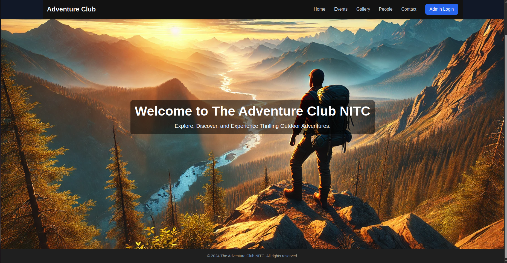
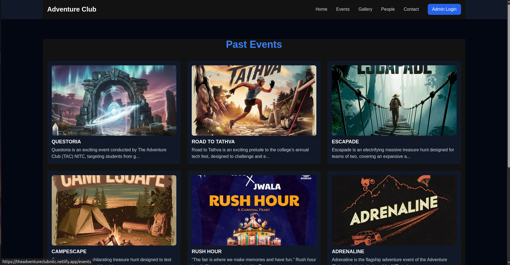
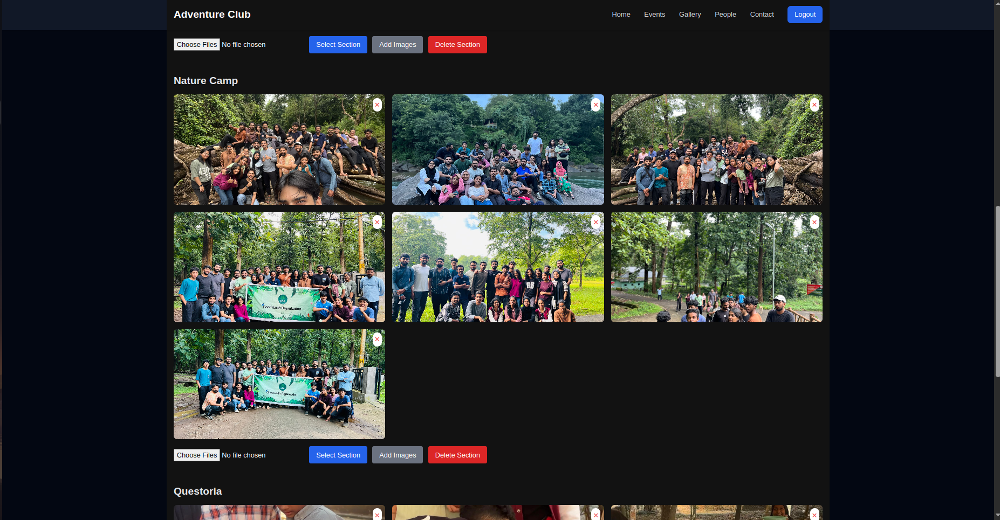
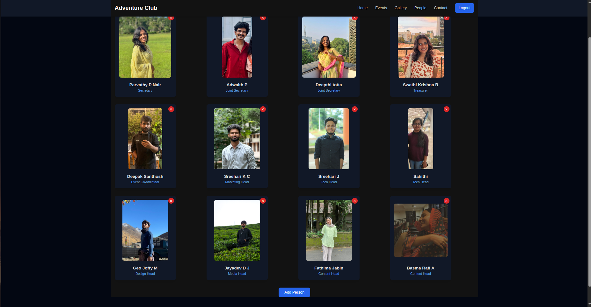
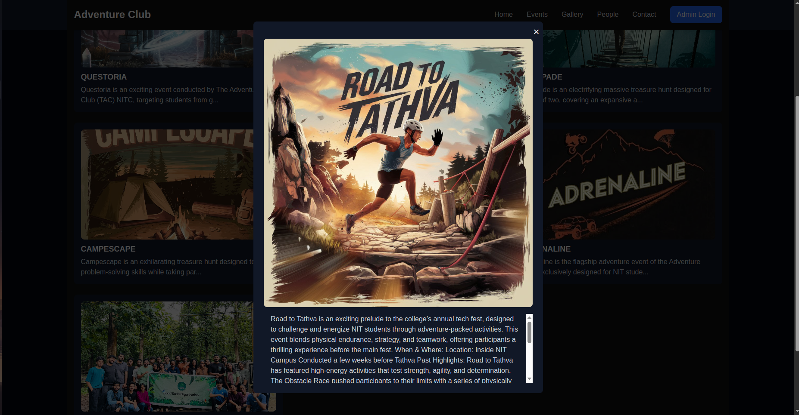

# 🌄 Adventure Club NITC Website

Welcome to the official website of **The Adventure Club, NIT Calicut** — a dynamic space for exploring our events, memories, and team! Built with **ReactJS**, styled using **TailwindCSS**, and powered by **Firebase**, this site showcases the adventurous spirit of our community.

🔗 [TheAdventureClubNITC Website Link](https://theadventureclubnitc.netlify.app/)

## 🖼️ Interface Preview

### Homepage

### Events Page

### Gallery Page

### People Page

### Event Details Page

## 🚀 Features

- 🧭 Dynamic event listing with Firebase Firestore
- 📸 Image gallery with Firebase Storage integration
- 👥 Admin-authenticated member management via Firebase Auth
- 📬 Email-based contact form using EmailJS
- 🔥 Smooth, responsive UI with TailwindCSS and React components

---

## 🛠️ Tech Stack

- **Frontend:** ReactJS
- **Styling:** TailwindCSS
- **Backend Services:** Firebase (Firestore, Storage, Authentication)
- **Email Integration:** EmailJS
- **Deployment:** Netlify

---

## 🙌 Contributing

Feel free to submit issues or pull requests if you have improvements or ideas to share!

---

## 📄 License

This project is open source and available under the [MIT License](LICENSE).
